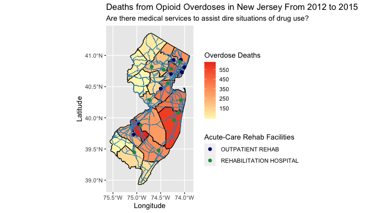

Total Deaths from Opioid Usage: NJ 2012-2015
================

## Introduction

Our map of New Jersey from 2012 to 2015 displays deaths from opioid
usage. The choropleth shows a range of death by county, and the dotted
plots are the locations for medical assistance like rehabilitation
services or hospitals. The choropleth helps [1]the audience distinguish
the number of deaths where the darker regions represent higher numbers
of deaths, and there were fewer deaths in lighter regions. Above the
gradient of colors, there is another layer of data. As we explored the
aftermath of overdosing, our team was fascinated in investigating the
state’s methods to combating drug-related deaths. Were there services
available to assist people struggling with addiction? [2] Access to
rehabilitation centers is crucial because their services are necessary
for dire situations, and visibility and access to these centers have
drastic consequences as serious as life or death. Our data support this
claim because the map shows fewer deaths in areas populated with these
services. In darker regions or southern New Jersey, there were more
deaths from opioid overdose; there were fewer hospitals and rehab
centers. In lighter-shaded areas, northern New Jersey, there are fewer
deaths and more medical services. This demonstrates that there may be a
relationship between deaths from opioid overdose and the lack of
rehabilitative services. This analysis prompted more questions: (1) is
it correlation or causation, (2) would the south have fewer deaths if
they were more medical services? In the future, we would also explore if
the average socio-economic status in counties is correlated with
overdoses.

    ##   |                                                                              |                                                                      |   0%  |                                                                              |                                                                      |   1%  |                                                                              |=                                                                     |   1%  |                                                                              |=                                                                     |   2%  |                                                                              |==                                                                    |   2%  |                                                                              |==                                                                    |   3%  |                                                                              |===                                                                   |   4%  |                                                                              |===                                                                   |   5%  |                                                                              |====                                                                  |   5%  |                                                                              |====                                                                  |   6%  |                                                                              |=====                                                                 |   7%  |                                                                              |=====                                                                 |   8%  |                                                                              |=======                                                               |   9%  |                                                                              |=======                                                               |  10%  |                                                                              |========                                                              |  11%  |                                                                              |=================                                                     |  24%  |                                                                              |=================                                                     |  25%  |                                                                              |==================                                                    |  26%  |                                                                              |===================                                                   |  27%  |                                                                              |====================                                                  |  28%  |                                                                              |=============================                                         |  41%  |                                                                              |==============================                                        |  43%  |                                                                              |==============================                                        |  44%  |                                                                              |===============================                                       |  44%  |                                                                              |===============================                                       |  45%  |                                                                              |================================                                      |  45%  |                                                                              |==================================                                    |  49%  |                                                                              |===================================                                   |  50%  |                                                                              |====================================                                  |  51%  |                                                                              |===========================================                           |  61%  |                                                                              |====================================================                  |  75%  |                                                                              |======================================================                |  78%  |                                                                              |=======================================================               |  78%  |                                                                              |================================================================      |  92%  |                                                                              |===================================================================   |  95%  |                                                                              |===================================================================   |  96%  |                                                                              |======================================================================| 100%

<!-- -->

This map shows three pivotal layers of data that contribute to the
conversation of deaths from opioid usage. The first layer of data shows
the gradient colors displaying the number of deaths, in other words, the
consequences of opioid use. The second layer of data is the dotted plots
showing the medical services available or the proactive solution to
combat overdoses. After identifying the overall trend that darker
regions had fewer medical services, we furthered our studies on
accessibility. In addition to assessing if the state had sufficient
rehabilitation centers and hospitals in each county, we plotted a third
layer of data using a map of prominent New Jersey roads. This would show
how accessible it is to commute to each Acute Care Facility. Like our
first map, we see that streets are more clustered in lighter regions
meaning there are more roads to the facilities in locations with fewer
overdose deaths. Alternatively, if we look at the county on the right
near the bottom shaded with the darkest orange, we see fewer roads for
the Rehabilitation Hospital. This data prompts further investigation
about the relationship between roads to medical services and deaths from
an opioid overdose. For example, are there fewer deaths in northern New
Jersey because there are more medical centers and roads to access those
services? Conversely, are there more deaths in some southern states
because there are fewer hospitals and rehabilitation centers and fewer
roads to get to those locations?[3]

[1] NJ drug overdose deaths by county 2004 to 2016 - dataset by NJDOTCOM
\[WWW Document\], 2017. \[WWW Document\]. data.world. URL
<https://data.world/njdotcom/nj-drug-overdose-deaths-by-county-2004-to-2016>
(accessed 11.19.21).

[2] Acute-care facility locations: NJOIT Open Data Center \[WWW
Document\], n.d. \[WWW Document\]. data.nj.gov. URL
<https://data.nj.gov/Health/Acute-Care-Facility-Locations/ars4-hngc>
(accessed 11.19.21).

[3] Tiger/line shapefile, 2015, State, New Jersey, primary and secondary
roads state-based shapefile \[WWW Document\], 2020. \[WWW Document\].
TIGER/Line Shapefile, 2015, state, New Jersey, Primary and Secondary
Roads State-based Shapefile - CKAN. URL
<https://catalog.data.gov/dataset/tiger-line-shapefile-2015-state-new-jersey-primary-and-secondary-roads-state-based-shapefile>
(accessed 11.19.21).
